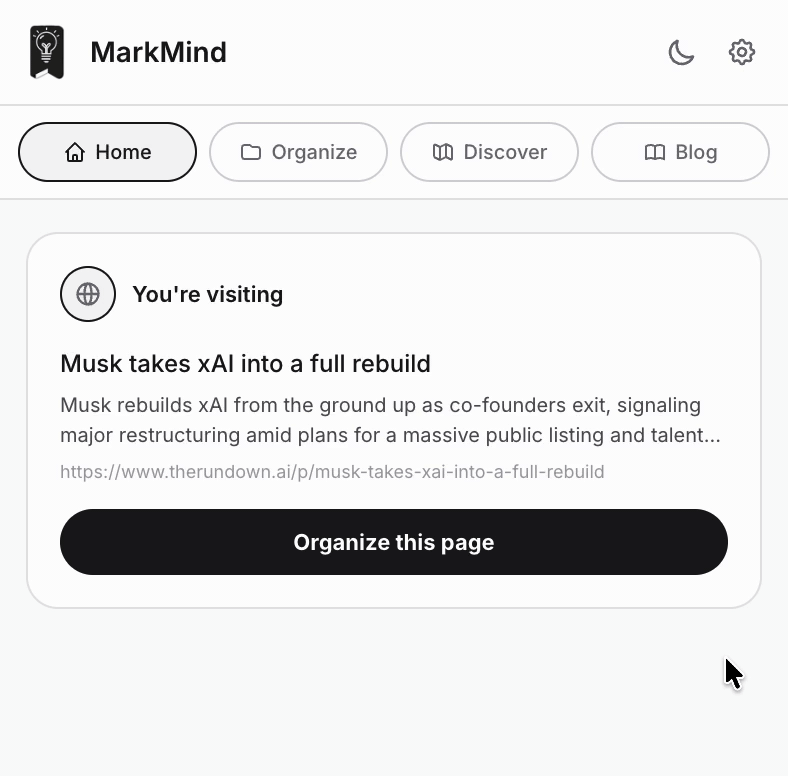
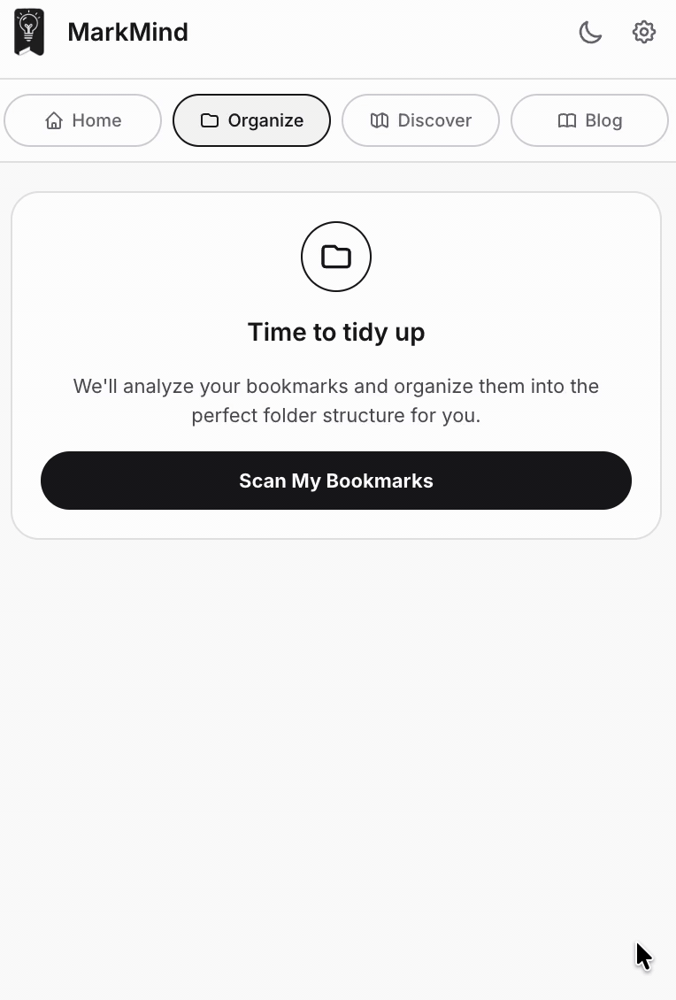
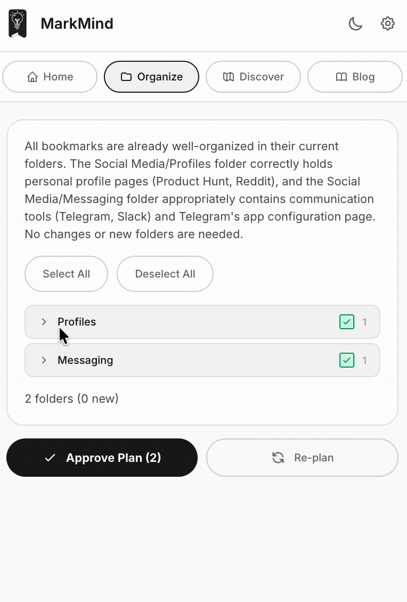
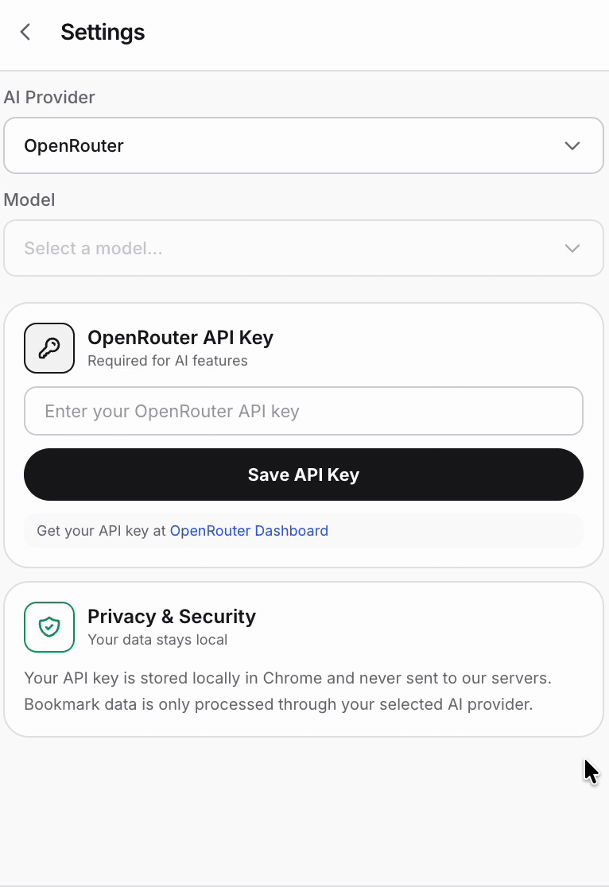

<div align="center">
  

  <h1>Markr</h1>

  <p><strong>Your AI Bookmark Manager</strong></p>

  <p>A Chrome/Edge extension that uses AI to file, declutter, and search your bookmarks — using your own API key, with everything stored locally.</p>
</div>

---

## Overview

Markr is a Manifest V3 browser extension that brings AI to your bookmarks. Instead of dumping links into an ever-growing "Other bookmarks" pile, Markr reads the page you are on, understands your existing folder structure, and suggests exactly where each bookmark belongs. It can also reorganize your entire library in bulk and answer natural-language questions about what you have saved.

You bring your own AI provider key. Markr never ships your data to a server we control — requests go directly from your browser to the provider you choose, and your keys live in local extension storage.



## Features

- **One-click page filing** — Open the popup on any page and Markr suggests the best existing folder (or proposes a new one) for the current tab.
- **Bulk organize** — Scan your whole bookmark library and let the AI propose a clean, reviewable folder structure before anything changes.

  

- **AI chat** — Ask questions like "find my React articles" or "organize my open tabs." The chat only touches open tabs when you explicitly ask it to; otherwise it works against your saved bookmarks.
- **You stay in control** — Every change is presented as a reviewable plan. Nothing is moved, renamed, or deleted without your confirmation.

  

- **Private by design** — Bring your own API key. Keys and preferences are stored in local browser storage, and AI requests go straight to your chosen provider.

  

## Supported AI providers

Markr lets you pick the provider that fits your needs. Add a key in **Settings**:

| Provider | Key prefix | Get a key |
| --- | --- | --- |
| Google Gemini | `AI…` | [Google AI Studio](https://aistudio.google.com/apikey) |
| OpenAI | `sk-…` | [OpenAI Platform](https://platform.openai.com/api-keys) |
| Anthropic | `sk-ant-…` | [Anthropic Console](https://console.anthropic.com/settings/keys) |
| OpenRouter | `sk-or-…` | [OpenRouter Dashboard](https://openrouter.ai/keys) |
| Custom / Local | optional | Any OpenAI-compatible endpoint (e.g. [Ollama](https://ollama.com)) |

Google Gemini is the default provider.

## Tech stack

- **React 19** + **TypeScript**
- **Vite 5** with [`@crxjs/vite-plugin`](https://crxjs.dev/vite-plugin) for the MV3 build
- **Chrome Extension APIs** — `bookmarks`, `tabs`, `storage`, `scripting`, `alarms`
- Plain CSS with a light/dark theme system

## Getting started

### Prerequisites

- [Node.js](https://nodejs.org) 18+
- An API key from one of the supported providers

### Install & build

```bash
# install dependencies
npm install

# start the dev server (HMR for the popup)
npm run dev

# create a production build in dist/
npm run build
```

### Load the extension

1. Run `npm run build` to generate the `dist/` folder.
2. Open `chrome://extensions` (or `edge://extensions`).
3. Enable **Developer mode**.
4. Click **Load unpacked** and select the `dist/` folder.
5. Open the Markr popup, go to **Settings**, and add your AI provider key.

## Available scripts

| Script | Description |
| --- | --- |
| `npm run dev` | Start Vite in development mode with hot reload. |
| `npm run build` | Type-check and build the production extension into `dist/`. |
| `npm run lint` | Run ESLint over the `src/` directory. |
| `npm run preview` | Preview the production build locally. |

## Project structure

```
src/
├── background.ts          # MV3 service worker (bookmark ops, AI orchestration)
├── main.tsx               # Popup entry point
├── App.tsx                # Root component (onboarding, theme, layout)
├── ChatTab.tsx            # AI chat interface
├── components/            # UI components (tabs, organize flow, settings, icons)
├── hooks/                 # React hooks (organize, onboarding, theme, API keys)
├── services/              # AI providers, bookmark + page metadata services
├── config/                # Provider, onboarding, and loading-message config
├── types/                 # Shared TypeScript types
└── utils/                 # Bookmark scanning and helper utilities
```

## Privacy

Markr is built around the principle that your data is yours. API keys and settings are kept in the browser's local extension storage, and AI requests are sent directly to the provider you configure. Markr does not run its own backend and does not collect your bookmarks.
